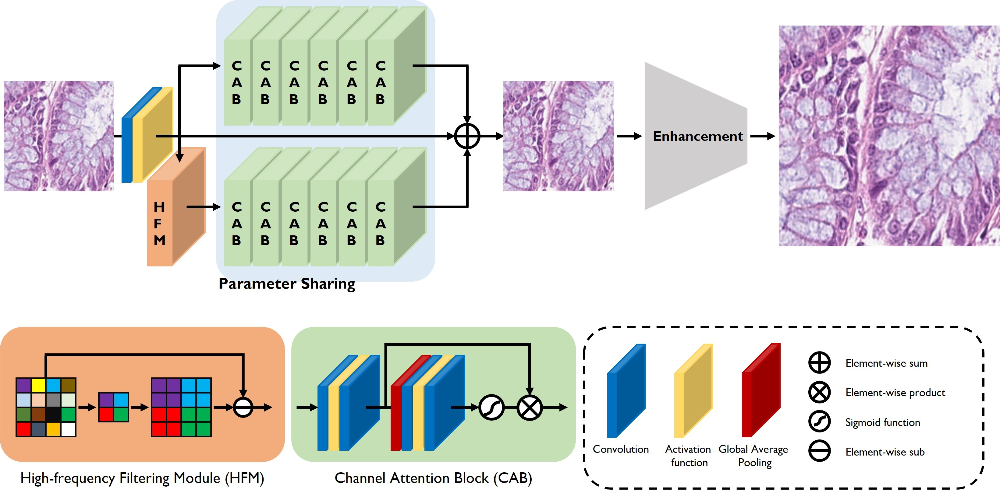
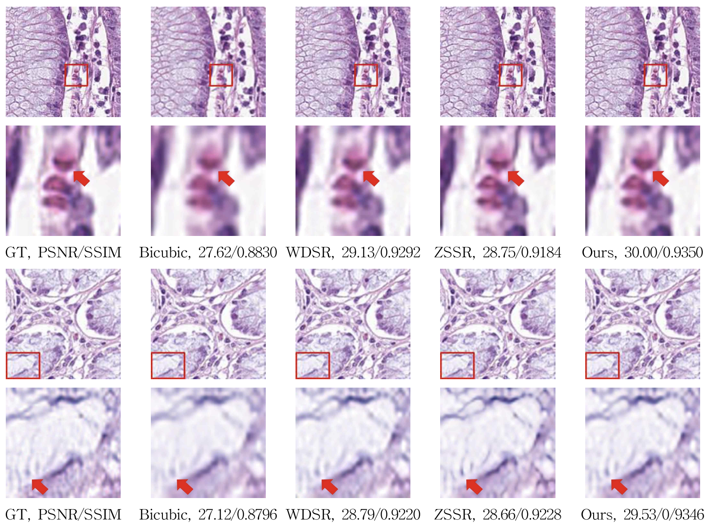

# Cell-ZSSR
### Zero-Shot Cell Image Super-Resolution

Code will comming soon.

Dataset Download Link : [Cell dataset](https://zenodo.org/record/1214456#.ZfjjttJBwUF)

## Overall Architecture
----------

----------

## SR result
----------
|  |  | Bicubic | VDSR | EDSR | SRGAN | WDSR | ZSSR | Ours |
|-------|:---------:|:---------:|:---------:|:---------:|:---------:|:---------:|:---------:|:---------:|
| x2 | PSNR | 30.30 | 29.93 | 31.42 | - | 31.84 | 32.70 | 32.74 |
| x2 | SSIM | 0.9160 | 0.9136 | 0.9322 | - | 0.9434 | 0.9521 | 0.9523 |
| x4 | PSNR | 24.11 | 24.72 | 24.72 | 23.87 | 24.99 | 24.74 | 24.83 |
| x4 | SSIM | 0.6761 | 0.6841 | 0.7193 | 0.6900 | 0.7282 | 0.7317 | 0.7318 |
----------

----------

----------

## Quick Start
```
python run_ZSSR.py
```
### Acknowledgement
This code is based on [ZSSR](https://github.com/assafshocher/ZSSR). Thanks for the greatest project.

This project dataset is used [100,000 histological images of human colorectal cancer and healthy tissue](https://zenodo.org/record/1214456#.ZfjjttJBwUF). Thanks for the awesome work.
